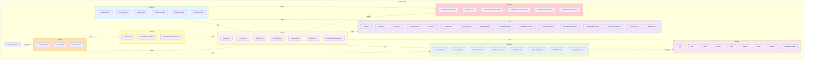

```mermaid
graph TB
    subgraph "com.example"
        BackendApplication[BackendApplication]
        
        subgraph "controller"
            AuthController
            UserController
            RoleController
            ProductController
            BasketController
            OrderController
        end
        
        subgraph "service"
            AuthService
            UserService
            RoleService
            ProductService
            BasketService
            OrderService
            CustomUserDetailsService
        end
        
        subgraph "repository"
            UserRepository
            RoleRepository
            ProductRepository
            BasketRepository
            OrderRepository
            AddressRepository
            BrandRepository
            CategoryRepository
        end
        
        subgraph "model"
            User
            Role
            Product
            Basket
            Order
            Address
            Brand
            Category
            OrderStatus[OrderStatus enum]
        end
        
        subgraph "dto"
            UserDTO
            RoleDTO
            ProductDTO
            BasketItemDTO
            OrderDTO
            LoginRequest
            LoginResponse
            RegisterRequest
            CreateUserRequest
            UpdateUserRequest
            CreateRoleRequest
            CreateProductRequest
            AddToBasketRequest
            CreateOrderRequest
            OrderItemDTO
            AddressDTO
        end
        
        subgraph "security"
            JwtService
            JwtAuthenticationFilter
            JwtAuthenticationEntryPoint
        end
        
        subgraph "config"
            SecurityConfig
            CorsConfig
            DataInitializer
        end
        
        subgraph "exception"
            GlobalExceptionHandler
            ErrorResponse
            ResourceNotFoundException
            DuplicateResourceException
            InvalidOperationException
            InsufficientStockException
        end
    end
    
    %% Dependencies
    controller -.->|uses| service
    controller -.->|uses| dto
    controller -.->|throws| exception
    
    service -.->|uses| repository
    service -.->|uses| model
    service -.->|uses| dto
    service -.->|throws| exception
    
    repository -.->|manages| model
    
    security -.->|uses| service
    config -.->|uses| security
    config -.->|uses| service
    config -.->|uses| repository
    
    BackendApplication -.->|bootstraps| config
    
    style controller fill:#e1f5ff
    style service fill:#fff4e1
    style repository fill:#e8f5e9
    style model fill:#fce4ec
    style dto fill:#f3e5f5
    style security fill:#fff9c4
    style config fill:#ffe0b2
    style exception fill:#ffcdd2
```