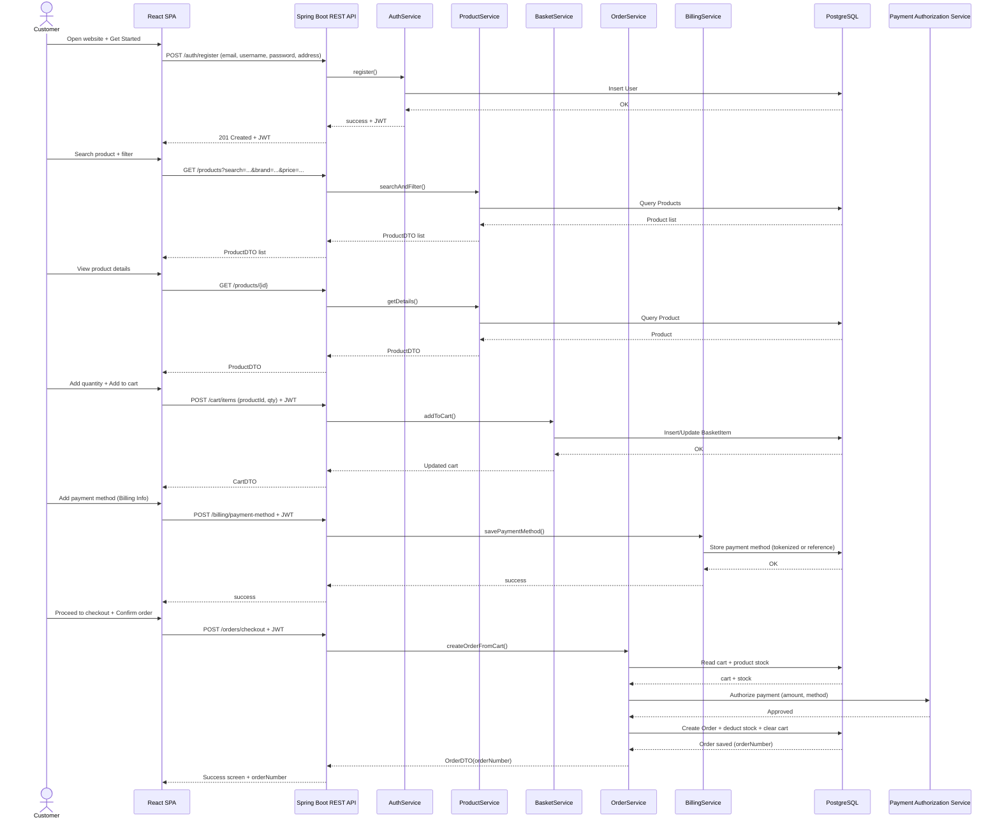

```mermaid
sequenceDiagram
    actor C as Customer
    participant FE as React SPA
    participant API as Spring Boot REST API
    participant AUTH as AuthService
    participant PROD as ProductService
    participant CART as BasketService
    participant ORD as OrderService
    participant BILL as BillingService
    participant DB as PostgreSQL
    participant PAY as Payment Authorization Service

    C->>FE: Open website + Get Started
    FE->>API: POST /auth/register (email, username, password, address)
    API->>AUTH: register()
    AUTH->>DB: Insert User
    DB-->>AUTH: OK
    AUTH-->>API: success + JWT
    API-->>FE: 201 Created + JWT

    C->>FE: Search product + filter
    FE->>API: GET /products?search=...&brand=...&price=...
    API->>PROD: searchAndFilter()
    PROD->>DB: Query Products
    DB-->>PROD: Product list
    PROD-->>API: ProductDTO list
    API-->>FE: ProductDTO list

    C->>FE: View product details
    FE->>API: GET /products/{id}
    API->>PROD: getDetails()
    PROD->>DB: Query Product
    DB-->>PROD: Product
    PROD-->>API: ProductDTO
    API-->>FE: ProductDTO

    C->>FE: Add quantity + Add to cart
    FE->>API: POST /cart/items (productId, qty) + JWT
    API->>CART: addToCart()
    CART->>DB: Insert/Update BasketItem
    DB-->>CART: OK
    CART-->>API: Updated cart
    API-->>FE: CartDTO

    C->>FE: Add payment method (Billing Info)
    FE->>API: POST /billing/payment-method + JWT
    API->>BILL: savePaymentMethod()
    BILL->>DB: Store payment method (tokenized or reference)
    DB-->>BILL: OK
    BILL-->>API: success
    API-->>FE: success

    C->>FE: Proceed to checkout + Confirm order
    FE->>API: POST /orders/checkout + JWT
    API->>ORD: createOrderFromCart()
    ORD->>DB: Read cart + product stock
    DB-->>ORD: cart + stock
    ORD->>PAY: Authorize payment (amount, method)
    PAY-->>ORD: Approved

    ORD->>DB: Create Order + deduct stock + clear cart
    DB-->>ORD: Order saved (orderNumber)
    ORD-->>API: OrderDTO(orderNumber)
    API-->>FE: Success screen + orderNumber

```